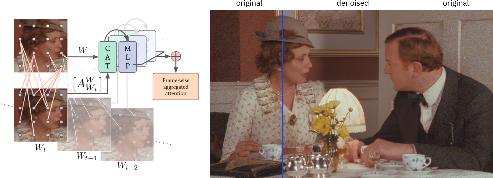
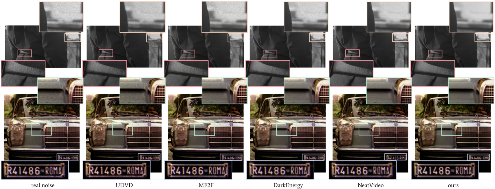
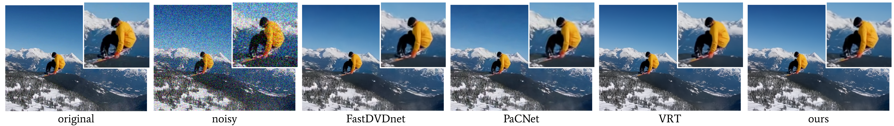

# Lightweight Video Denoising using Aggregated Shifted Window Attention

####  IEEE/CVF Winter Conference on Applications of Computer Vision - WACV 2023 | [PDF](https://openaccess.thecvf.com/content/WACV2023/papers/Lindner_Lightweight_Video_Denoising_Using_Aggregated_Shifted_Window_Attention_WACV_2023_paper.pdf) |
#### 

State-of-the-art attention-based denoising methods typically yield good results, but require vast amounts of GPU memory and usually suffer from very long computation times. 
Especially in the field of restoring high-resolution videos, these techniques are not practical.
To overcome these issues, we introduce a lightweight video denoising network that combines efficient axial-coronal-sagittal (ACS) convolutions with a novel shifted window attention formulation (ASwin), which is based on the memory-efficient aggregation of self- and cross-attention across video frames.
Our model can be used for general-purpose blind denoising of high-resolution real-world videos, due to being trained on realistic clean-noisy video pairs, generated by an authentic noise synthesis pipeline.


<div align="center">

</div>

<br />

## Trained Weights and Test Data

After cloning this repository, follow these steps:
- Download the pre-trained model weights from [here](https://drive.google.com/file/d/10cb3hGqXN9wpEXHxLFyDKmnSnKz9_JBe/view?usp=sharing) and unzip the archive within the folder **'model_weights'**.
- Download test samples of our *real-world historic test data* and the full test set of *Davis2017* [here](https://drive.google.com/file/d/1jYB-ASoRuSMPEvyKPkyzRbehSgbf6j7V/view?usp=sharing) and unzip the archive within the folder **'data'**.


## Requirements

* PyTorch
* CV2
* ACSConv
* tqdm
* Einops

## Testing the Blind-Denoising Model for Real-World Noisy Videos

To test the model's performance under real-world noise conditions, run **test_real_noise.py** as shown below.
If you run out of GPU-memory, try to either reduce *--num_frame_testing* or to set *--patch_img* to *True*, at the expense of slightly decreased denoising performance.

**Command-line Arguments:**
- `--num_frame_testing`: Number of video frames to be processed in parallel, *must be a multiple of 6 due to spatial size of attention window* *(Default: 24)*
- `--num_frame_overlapping`: Number of overlapping frames between processed sequences *(Default: 2)*
- `--patch_img`: Spatial patching of the input video *(Default: False)*
- `--patch_size`: Size of spatial patch *(Default: 1024)*
- `--file_list`: Path to CSV file containing location of test videos *(Default: `./data/test_real_noise/files.csv`.`)*


**Usage:**

Run the following command in your terminal, the denoised video frames will be saved in the folder **'results'**.

```console
python test_real_noise.py --num_frame_testing 24 --num_frame_overlapping 2 --file_list ./data/test_real_noise/files.csv
```
##

## Testing the Non-Blind Gaussian Denoising Model

To test the model's performance for additive Gaussian noise, run **test_gauss_noise.py** as shown below.
If you run out of GPU-memory, try to either reduce *--num_frame_testing* or to set *--patch_img* to *True*, at the expense of slightly decreased denoising performance.

**Command-line Arguments:**
- `--noise_sigma`: Sigma value for Gaussian noise *(Default: 20)*
- `--num_frame_testing`: Number of video frames to be processed in parallel, *must be a multiple of 6 due to spatial size of attention window* *(Default: 24)*
- `--num_frame_overlapping`: Number of overlapping frames between processed sequences *(Default: 2)*
- `--patch_img`: Spatial patching of the input video *(Default: False)*
- `--patch_size`: Size of spatial patch *(Default: 1024)*
- `--file_list`: Path to CSV file containing location of test videos *(Default: `./data/davis2017/files.csv`)*

**Usage:**

Run the following command in your terminal, the denoised video frames will be saved in the folder **'results'**.


```console
python test_gauss_noise.py --noise_sigma 20 --num_frame_testing 24 --num_frame_overlapping 2 --file_list ./data/davis2017/files.csv
```
##

## Blind Denoising Results for historic Real-world Videos

Denoising digitized analog videos is even more challenging than other real-world denoising tasks, due to a high spatial correlation of noise induced by the physical structure of analog film and additional digital noise caused by the digitizing process. To evaluate the different methods, we used 10 high-resolution sequences of real digitized analog film footage, exhibiting different unknown noise types of varying strength. 
We compare our approach to the state-of-the-art real-world denoising methods [MF2F](https://openaccess.thecvf.com/content/WACV2021/papers/Dewil_Self-Supervised_Training_for_Blind_Multi-Frame_Video_Denoising_WACV_2021_paper.pdf) and [UDVD](https://openaccess.thecvf.com/content/ICCV2021/papers/Sheth_Unsupervised_Deep_Video_Denoising_ICCV_2021_paper.pdf), as well as two commercial denoising tools for high-end video restoration, namely [NeatVideo](https://www.neatvideo.com/) and [DarkEnergy](https://cinnafilm.com/product/dark-energy/).

<div align="center">

</div>

<br />
  
Since the actual ground truth is not available for real-world noisy videos, standard quality assessment metrics, such as PSNR, cannot be computed.
Therefore we perform a No-Reference Image Quality Assessment (NR-IQA) on the denoised real videos for a quantitative comparison. We use the state-of-the-art NR-IQA metric [MUSIQ](https://openaccess.thecvf.com/content/ICCV2021/papers/Ke_MUSIQ_Multi-Scale_Image_Quality_Transformer_ICCV_2021_paper.pdf), which is computed by a multi-scale image quality transformer.


|          | **noisy** | **UDVD** | **MF2F** | **DarkEnergy** | **NeatVideo** | **ours** |
|-----------------|-----------|----------|------------|------------|-------------|------------|
|**MUSIQ score**| 25.11     | 25.77    | 35.29    | 31.05          | 33.14         | 38.16    |


## Non-blind Denoising Results for additive Gaussian Noise

Although not specifically designed for additive Gaussian denoising, we evaluate our approach on two commonly used data sets for synthetic denoising: Set8 and DAVIS2017. To obtain a quantitative comparison to state-of-the-art methods, we evaluate the denoising performance in terms of PSNR. Our model yields results close to the state-of-the-art method [VRT](https://arxiv.org/pdf/2201.12288.pdf) and consistently outperforms all other competing methods. When considering both denoising performance and runtime, we can observe that the better performance of VRT comes with a significantly increased runtime - VRT is ~20 times slower than our model. 




#### Gaussian denoising results on DAVIS test set
|          | **VBM4D** | **VNLB** | **DVDnet** | **VNLnet** | **FastDVD** | **PaCNet** | **VRT** | **ours** |
|-----------------|-----------|----------|------------|------------|-------------|------------|---------|----------|
| **σ=10**   | 37.58     | 38.85    | 38.13      | 35.83      | 38.71       | 39.97      | 40.82   | 40.15    |
| **σ=20**   | 33.88     | 35.68    | 35.70      | 34.49      | 35.77       | 36.82      | 38.15   | 37.12    |
| **σ=30**   | 31.65     | 33.73    | 34.08      | 32.86      | 34.04       | 34.79      | 36.52   | 35.37    |
| **σ=40**   | 30.05     | 32.32    | 32.86     | 32.32      | 32.82       | 33.34      | 35.32   | 34.13    |
| **σ=50**   | 28.80     | 31.13    | 31.90      | 31.43      | 31.86       | 32.20      | 34.36   | 33.17    |


#### Gaussian denoising results on Set8 test set
|          | **VBM4D** | **VNLB** | **DVDnet** | **VNLnet** | **FastDVD** | **PaCNet** | **VRT** | **ours** |
|-----------------|-----------|----------|------------|------------|-------------|------------|---------|----------|
| **σ=10**   | 36.05     | 37.26    | 36.08      | 37.10      | 36.44       | 37.06      | 37.88   | 36.99    |
| **σ=20**   | 32.19     | 33.72    | 33.49      | 33.88      | 33.43       | 33.94      | 35.02   | 34.06    |
| **σ=30**   | 30.00     | 31.74    | 31.68      | 31.59      | 31.68       | 32.05      | 33.35   | 32.41    |
| **σ=40**   | 28.48     | 30.39    | 30.46      | 30.55      | 30.46       | 30.70      | 32.15   | 31.22    |
| **σ=50**   | 27.33     | 29.24    | 29.53      | 29.47      | 29.53       | 29.66      | 31.22   | 30.31    |


#### Runtime comparison 
|          | **VBM4D** | **VNLB** | **DVDnet** | **VNLnet** | **FastDVD** | **PaCNet** | **VRT** | **ours** |
|-----------------|-----------|----------|------------|------------|-------------|------------|---------|----------|
| **runtime (s)** | 156.0     | 420.0    | 4.91       | 1.87       | 0.08        | 24.64      | 7.86    | 0.37     |


## License

Creative Commons Attribution-NonCommercial 4.0 International License ([CC-BY-NC-4.0](LICENSE.md))

### Citation
If you use this code for your research, please cite our paper:

```bibtex
@InProceedings{Lindner_2023_WACV,
    author    = {Lindner, Lydia and Effland, Alexander and Ilic, Filip and Pock, Thomas and Kobler, Erich},
    title     = {Lightweight Video Denoising Using Aggregated Shifted Window Attention},
    booktitle = {Proceedings of the IEEE/CVF Winter Conference on Applications of Computer Vision (WACV)},
    month     = {January},
    year      = {2023},
    pages     = {351-360}
}

